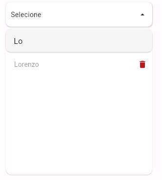
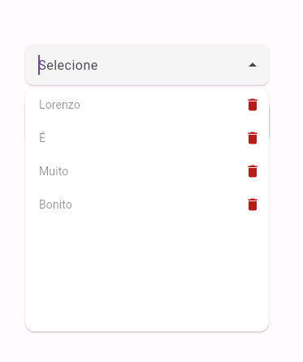
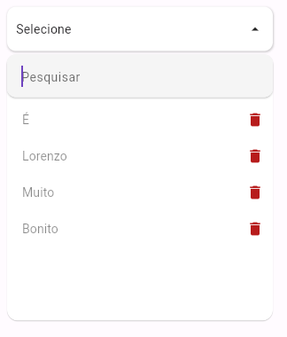
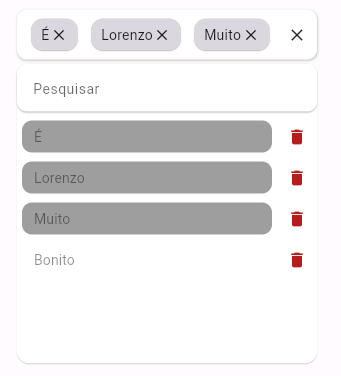

# Search Dropdown
Search DropDown is a dropdown that offers a search bar, multiple and single selections.

## Import
```dart
import 'package:searchdropdown/simple_search_dropdown.dart';
```

## Getting Started
This project is a widget to find items in a list without sacrifying beauty and usefulness:

- Different styles: Search DropDown can be customized with various styles, including colors, text styles, icons, and more.
- Multiple and single options: Search DropDown can be used to select multiple or single items.
- Add and Delete Mode: Search Dropdown accepts functions to add and delete items from the list inside it
- Compact and Simple: Search DropDown is very compact and takes up very little space on the screen.

## Usage

### Features

#### Add Mode:


#### Delete Mode:


#### Search:


### 1. Single SearchDropDown

```dart
    SearchDropDown(
        listItens: listitems,
        onDeleteItem: removeItem, 
        onAddItem: addItem,
        addMode: true,
        deleteMode: true,
        updateSelectedItem: updateSelectedItem,
    ),
```



### 2. Multiple SearchDropDown

```dart
    MultipleSearchDropDown(
        listItems: listitems,
        onDeleteItem: removeItem, 
        onAddItem: addItem,
        addMode: true,
        deleteMode: true,
        selectedItems: selectedMultipleItems,
        updateSelectedItems: updateSelectedItems,
    ),
```





## License

[](/LICENSE)
